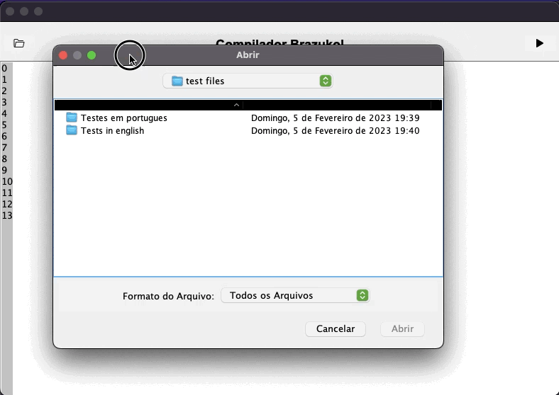

<p align="center">
  <a href="https://img.shields.io/github/repo-size/Danilo-Js/Compilador_Brazukol/commits/master">
    
  </a>

  <a href="https://img.shields.io/github/issues/Danilo-Js/Compilador_Brazukol/issues">
    
  </a>
  
  
  
  
  
  
  
</p>

<h1 align="center">
   Compilador Brazukol :brazil:
</h1>

<p align="center" direction="row">
  <a href="#rocket-sobre-o-projeto">Sobre o projeto</a>&nbsp;&nbsp;&nbsp;|&nbsp;&nbsp;&nbsp;
  <a href="#information_source-diretórios">Diretórios</a>&nbsp;&nbsp;&nbsp;|&nbsp;&nbsp;&nbsp;
  <a href="#memo-licença">Licença</a>&nbsp;&nbsp;&nbsp;|&nbsp;&nbsp;&nbsp;
  <a href="#busts_in_silhouette-baixe-este-projeto">Baixe este projeto</a>
</p>

</br>

<p align="center">
  
</p>

</br>

## :rocket: Sobre o projeto
Este repositório faz parte de um trabalho acadêmico apresentado à disciplina de Compiladores, ministrada pelo professor Rodrigo Freitas Silva na Universidade Federal do Espírito Santo.

Neste trabalho foi feita uma IDE simples para a linguagem brazukol, uma linguagem adaptada do portugol.

### Análise léxica


## :information_source: Diretórios
:file_folder: [Documentos](https://github.com/Danilo-Js/Biblioteca-Virtual/tree/main/Documentos)
* [ATA da Reunião](https://github.com/Danilo-Js/Biblioteca-Virtual/blob/main/Documentos/ATA%20da%20reuniao.pdf)
* [Entrevista](https://github.com/Danilo-Js/Biblioteca-Virtual/blob/main/Documentos/Entrevista.pdf)
* [Documento principal](https://github.com/Danilo-Js/Biblioteca-Virtual/blob/main/Documentos/Documento%20principal.pdf)

:black_joker: [Protótipos](https://github.com/Danilo-Js/Biblioteca-Virtual/tree/main/Protótipos)

:page_with_curl: [Questionário](https://github.com/Danilo-Js/Biblioteca-Virtual/tree/main/Questionário)

## :busts_in_silhouette: Baixe este projeto

```bash
# Clone o repositório
$ git clone https://github.com/Danilo-Js/Biblioteca-Virtual.git
# Baixe os arquivos atualizados
$ git pull
```


## :memo: Licença
Este projeto está com a licença MIT. [Clique aqui](https://github.com/Danilo-Js/Biblioteca-Virtual/blob/master/LICENSE) para vê-la.

---

#### Feito por Danilo José Lima de Oliveira, Fabrício Medeiros Tozo, Matheus da Silva Rocha, Isabela Coelho Fonseca.
